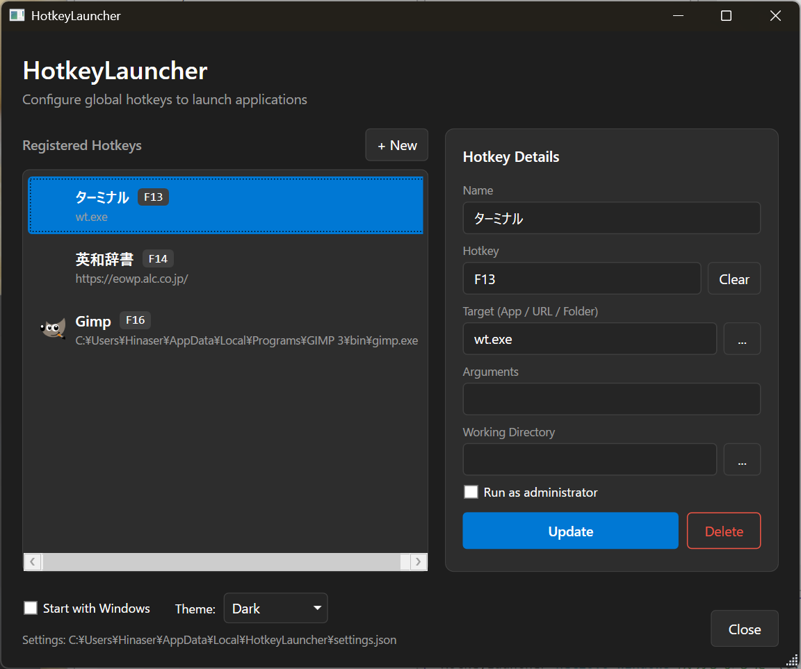

# HotkeyLauncher

A lightweight Windows application for launching apps, opening URLs, and folders using customizable global hotkeys.

> **Note**: This project was 99% generated by [Claude Opus 4.5](https://www.anthropic.com/claude) using [Claude Code](https://docs.anthropic.com/en/docs/claude-code).



## Features

- **Global Hotkeys** - Register system-wide keyboard shortcuts that work from any application
- **Launch Applications** - Open any executable with optional command-line arguments
- **Open URLs** - Launch websites in your default browser
- **Open Folders** - Quickly access frequently used directories
- **Run as Administrator** - Optionally launch applications with elevated privileges
- **System Tray** - Runs quietly in the background with minimal resource usage
- **Dark/Light Theme** - Choose your preferred appearance
- **Auto-save** - Changes are saved automatically
- **Drag & Drop Reordering** - Easily organize your hotkeys
- **Startup Option** - Optionally start with Windows
- **F13-F24 Support** - Use extended function keys for conflict-free hotkeys

## Requirements

- Windows 10/11 (x64)

## Installation

### Option 1: Download Installer (Recommended)

Download the latest installer from the [Releases](https://github.com/Hinaser/HotkeyLauncher/releases) page.

> **Note**: Windows SmartScreen may show a warning for unsigned installers. Click "More info" → "Run anyway" to proceed.

### Option 2: Build from Source

```bash
# Clone the repository
git clone https://github.com/Hinaser/HotkeyLauncher.git
cd HotkeyLauncher

# Build
dotnet build

# Publish self-contained executable
dotnet publish -c Release
```

The published executable will be in `HotkeyLauncher/bin/Release/net10.0-windows/win-x64/publish/`.

### Building the Installer

To create the installer, you need [Inno Setup](https://jrsoftware.org/isinfo.php) installed.

```bash
# First, publish the application
dotnet publish -c Release

# Then compile the installer (using Inno Setup CLI)
iscc installer/HotkeyLauncher.iss
```

The installer will be created in the `dist/` folder.

## Usage

1. **Launch the app** - It will appear in the system tray
2. **Open settings** - Double-click the tray icon or right-click and select "Settings"
3. **Add a hotkey**:
   - Enter a name for the shortcut
   - Click the Hotkey field and press your desired key combination
   - Enter the target (application path, URL, or folder path)
   - Click "Add New Hotkey"
4. **Use your hotkeys** - Press the registered key combination from anywhere

### Target Examples

| Type | Example |
|------|---------|
| Application | `C:\Program Files\Notepad++\notepad++.exe` |
| Application (in PATH) | `wt.exe` (Windows Terminal) |
| URL | `https://github.com` |
| Folder | `C:\Users\YourName\Documents` |

### Recommended Hotkeys

To avoid conflicts with existing shortcuts, consider using:

- **F13-F24** - Extended function keys (great for keyboards that support remapping like Nuphy)
- **Ctrl + Shift + Alt + [Key]** - Triple modifier combinations
- **Win + [Uncommon Key]** - Windows key with less common keys

## Configuration

Settings are stored in:
```
%LOCALAPPDATA%\HotkeyLauncher\settings.json
```

## Building

### Prerequisites

- [.NET 10.0 SDK](https://dotnet.microsoft.com/download/dotnet/10.0)
- Visual Studio 2022 or VS Code (optional)

### Commands

```bash
# Debug build
dotnet build

# Release build
dotnet build -c Release

# Publish single-file executable
dotnet publish -c Release

# Run
dotnet run
```

## License

MIT License - see [LICENSE](LICENSE) for details.

## Contributing

Contributions are welcome! Please feel free to submit a Pull Request.
